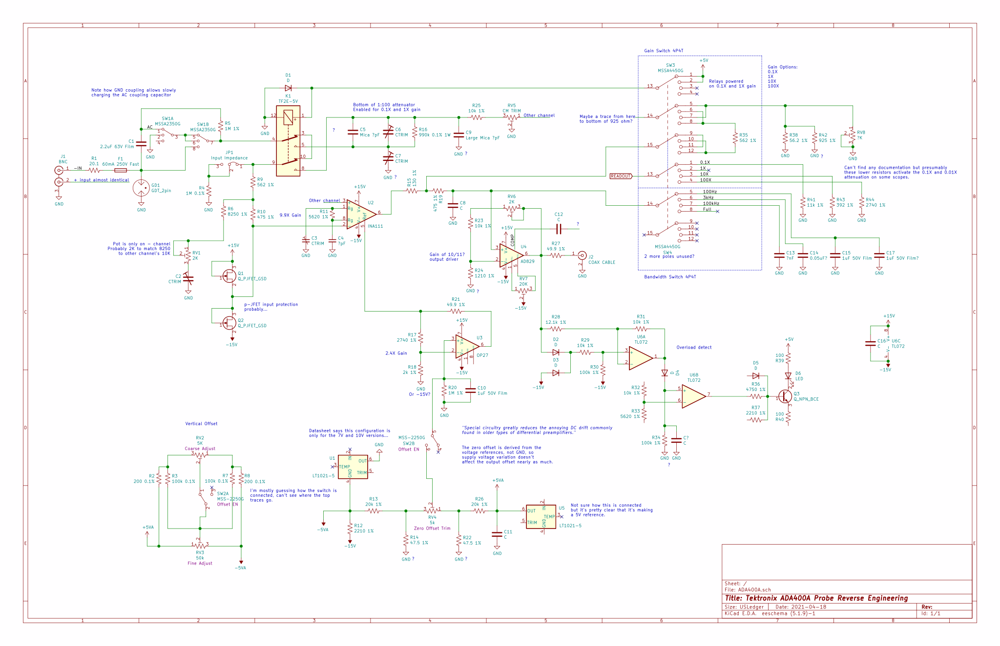
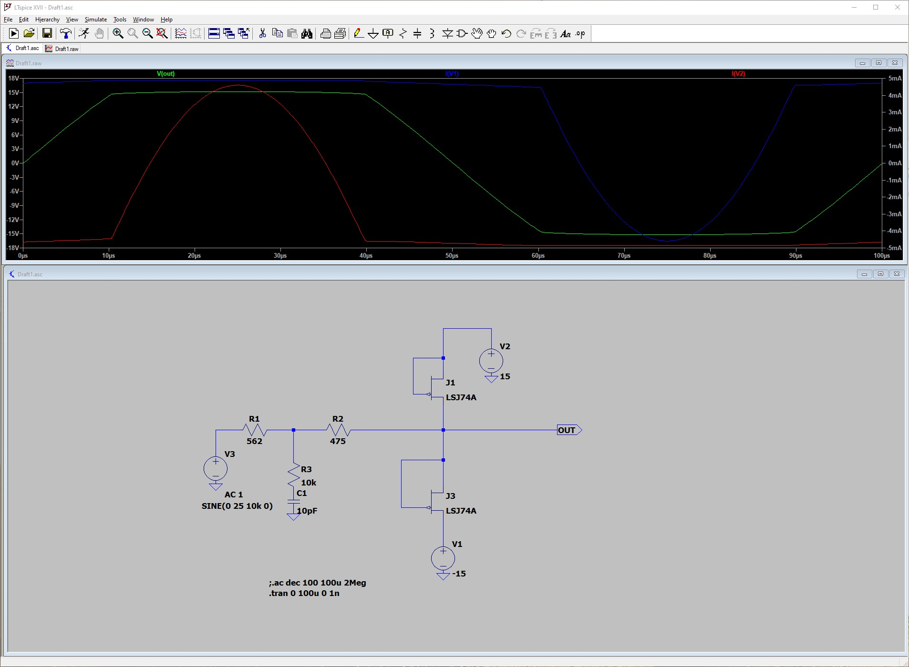

# Tektronix ADA400A Reverse Engineering

Almost complete, almost correct schematics for the Tektronix ADA400A Differential Preamplifier.
Reverse engineered from [photos on xDevs.com](https://xdevs.com/fix/ada400a/).

The p-JFET (?) input protection is interesting and unique as far as I can tell. Can't find it anywhere else.

## License

Images are derivitive works of xDevs.com's images. Their policy is "All data presented here is free for grabs and use, without any warranties."
I say the same about my images and schematics. I make no guarantees about the accuracy or safety of the circuits in the schematics.